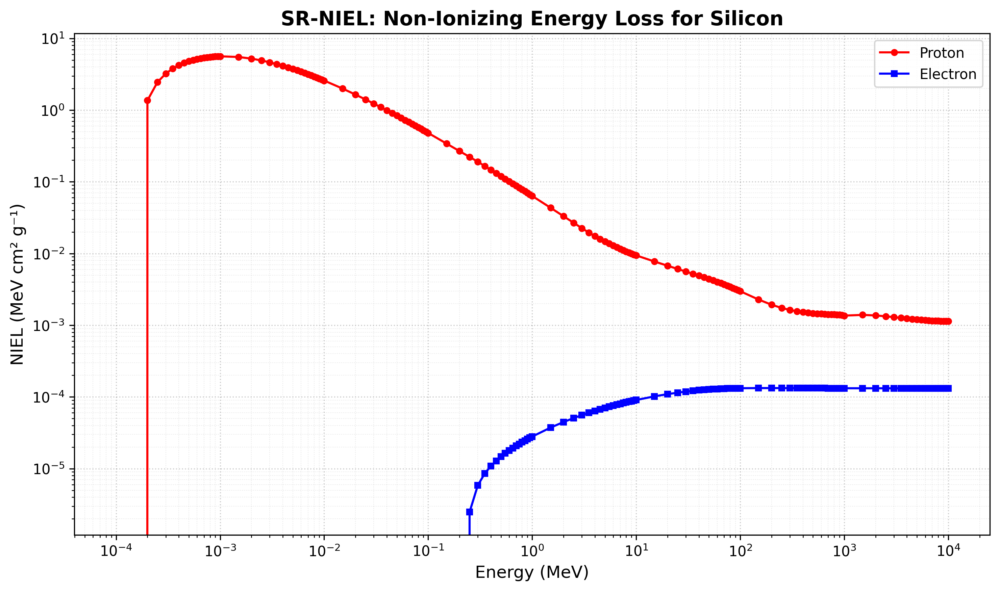
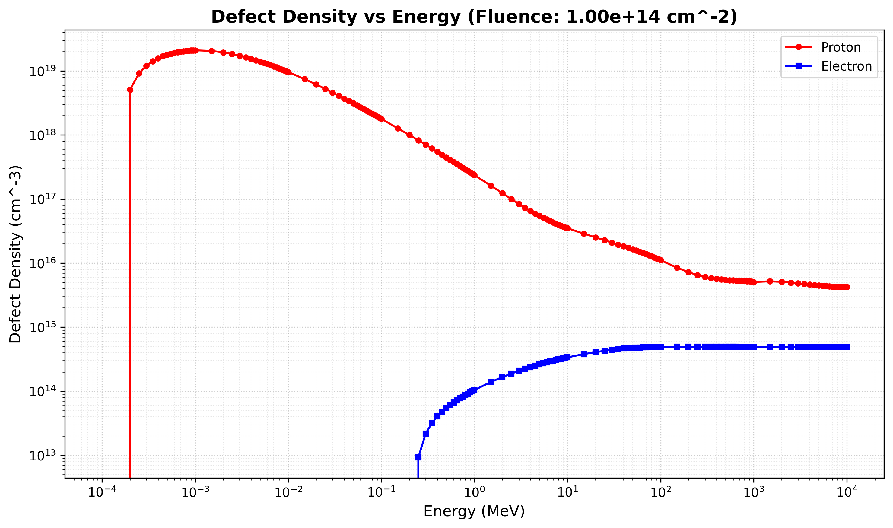
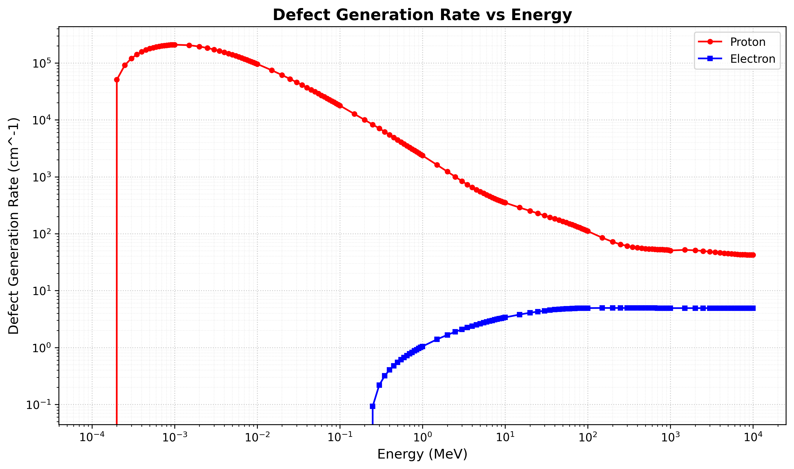
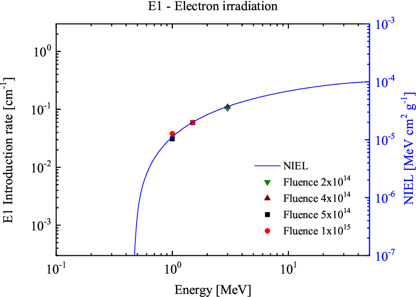
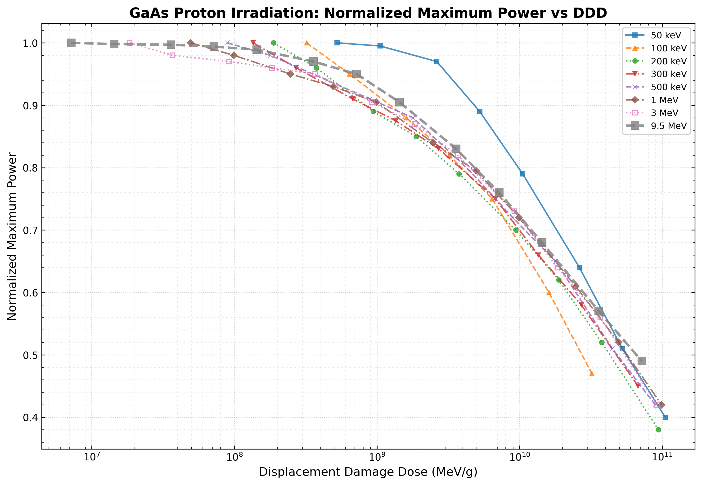
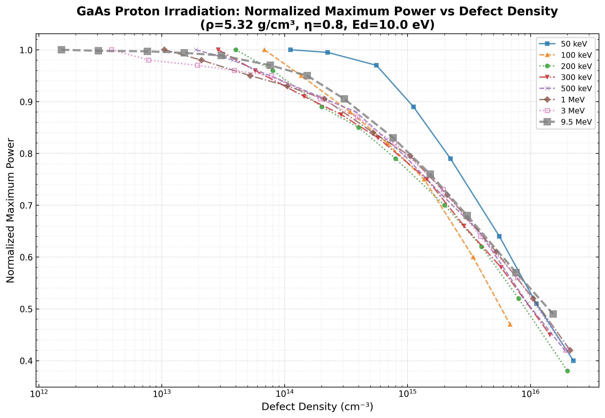

# SR-NIEL PDF解析と可視化ツール

SR-NIELのPDF結果ファイルからprotonとelectronのNIEL（Non-Ionizing Energy Loss）データを抽出し、CSV形式で保存、さらにグラフをPNG形式で出力するツールです。さらに、NIELデータから欠陥数密度と欠陥生成率を計算し、可視化します。

このプロジェクトは[GitHubリポジトリ](https://github.com/shirokawakita/sr_niel_analysis)で公開されています。

## ディレクトリ構成

このプロジェクトは以下のディレクトリ構成になっています：

- `src/` - Pythonスクリプト
- `data/` - データファイル
  - `data/csv/` - CSVデータファイル
  - `data/pdf/` - PDFファイル（SR-NIEL結果、論文等）
- `images/` - 生成されたグラフ画像（PNG形式）

詳細は[DIRECTORY_STRUCTURE.md](DIRECTORY_STRUCTURE.md)を参照してください。

## データソース

このツールで使用するNIELデータは、[SR-NIEL Web計算機](https://www.sr-niel.org/index.php/sr-niel-web-calculators)から取得したPDF結果ファイルを使用します。

SR-NIEL（Screened Relativistic treatment for NIEL）は、粒子の非電離エネルギー損失（NIEL）を計算するためのWebベースの計算機です。以下の計算機を使用してNIELデータを取得できます：

- **NIEL and dose calculator for electrons, protons and ions** - 単一粒子のNIEL計算
- **NIEL and dose calculator for spectral fluence of electrons, protons and ions** - スペクトルフルエンスのNIEL計算

### データ取得手順

1. [SR-NIEL Web計算機](https://www.sr-niel.org/index.php/sr-niel-web-calculators)にアクセス
2. 対象材料（例：シリコン）を選択
3. 粒子種（ProtonまたはElectron）を選択
4. エネルギー範囲を設定して計算を実行
5. 結果をPDF形式でダウンロード

出力されるPDFファイルには、エネルギーとNIEL値の表が含まれています。

## 必要な環境

- Python 3.10以上
- Anaconda（推奨）

## セットアップ

1. Anaconda環境の作成とアクティベート：
```bash
conda create -n sr_niel python=3.10 -y
conda activate sr_niel
```

2. 必要なライブラリのインストール：
```bash
pip install -r requirements.txt
```

または個別にインストール：
```bash
pip install pdfplumber pandas matplotlib numpy
```

## 使用方法

### 主要スクリプト

このプロジェクトには以下の主要スクリプトが含まれています：

#### 1. NIELデータ抽出と基本解析

**`src/extract_niel_data.py`** - NIELデータ抽出と欠陥計算のメインスクリプト

このツールは、コマンドライン引数としてProtonとElectronのPDFファイルのパスを受け取ります：

```bash
python src/extract_niel_data.py data/pdf/proton.pdf data/pdf/electron.pdf
```

ファイル名にスペースが含まれる場合は、引用符で囲んでください：

```bash
python src/extract_niel_data.py "data/pdf/SR-NIEL Results_silicon_proton.pdf" "data/pdf/SR-NIEL Results_silicon_electron.pdf"
```

このスクリプトは以下を実行します：
- PDFからNIELデータを抽出
- DDD、欠陥数密度、欠陥生成率を計算
- CSVファイルとグラフを生成

#### 2. Ed依存性解析

**`src/analyze_ed_dependency.py`** - Ed（置換閾値エネルギー）依存性解析スクリプト

異なるEd値（10, 21, 30, 40, 50 eV）でのSi電子線NIELデータを比較し、1MeVでの欠陥生成率のEd依存性を可視化します：

```bash
python src/analyze_ed_dependency.py
```

このスクリプトは以下を生成します：
- `data/csv/niel_electron_ed_*.csv` - 各Ed値でのNIELデータ
- `data/csv/defect_generation_rate_1mev_ed_dependency.csv` - 1MeVでの欠陥生成率のEd依存性データ
- `images/niel_electron_ed_comparison.png` - 異なるEd値でのNIEL比較グラフ
- `images/defect_generation_rate_1mev_ed_dependency.png` - 1MeVでの欠陥生成率のEd依存性グラフ

#### 3. GaAs太陽電池の陽子線照射解析

**`src/extract_gaas_proton_niel.py`** - GaAsのProton NIELデータ抽出スクリプト

```bash
python src/extract_gaas_proton_niel.py
```

このスクリプトは以下を生成します：
- `data/csv/niel_gaas_proton.csv` - GaAsのProton NIELデータ
- `images/niel_gaas_proton_plot.png` - GaAsのProton NIELグラフ

**`src/plot_gaas_ddd_degradation.py`** - DDD基準の劣化カーブ作成スクリプト

```bash
python src/plot_gaas_ddd_degradation.py
```

このスクリプトは以下を生成します：
- `images/gaas_proton_ddd_degradation_plot.png` - DDD基準の劣化カーブグラフ

**`src/plot_gaas_defect_density_degradation.py`** - 欠陥数密度基準の劣化カーブ作成スクリプト

```bash
python src/plot_gaas_defect_density_degradation.py
```

このスクリプトは以下を生成します：
- `images/gaas_proton_defect_density_degradation_plot.png` - 欠陥数密度基準の劣化カーブグラフ

**注意**: すべてのスクリプトは、プロジェクトルートディレクトリから実行してください。

### 入力ファイル

- **proton.pdf**: ProtonのNIELデータが含まれるPDFファイル
- **electron.pdf**: ElectronのNIELデータが含まれるPDFファイル

PDFファイルは、SR-NIEL Web計算機から取得した結果ファイルである必要があります。ファイルには、エネルギー（MeV）とNIEL値（MeV cm² g⁻¹）の表が含まれている必要があります。

## 計算式

### DDD（Displacement Damage Dose）の計算

DDDは、NIELとフルエンスから計算されます：

```
DDD = NIEL × フルエンス
```

- DDDの単位: MeV/g
- NIELの単位: MeV cm²/g
- フルエンスの単位: cm⁻²

### 欠陥数密度の計算（NRTモデル）

DDDから欠陥数密度を計算します（NRTモデル：Norgett-Robinson-Torrensモデル）：

```
欠陥数密度 (cm⁻³) = (DDD × ρ × η) / (2 × Ed)
```

ここで：
- DDD: Displacement Damage Dose (MeV/g)
- ρ: 材料の密度 (g/cm³) - シリコンの場合、2.33 g/cm³
- η: 欠陥生成効率 - NRTモデルの場合、0.8
- Ed: はじき出ししきい値 (eV) - シリコンの場合、25 eV
- 2Ed: 1 Frenkelペア生成に必要なエネルギー

### 欠陥生成率の計算

欠陥生成率は、欠陥数密度をフルエンスで割った値です：

```
欠陥生成率 (cm⁻¹) = 欠陥数密度 / フルエンス
```

欠陥生成率は、1粒子あたりに生成される欠陥数密度を表す指標で、フルエンスに依存しない特性値です。

欠陥数密度の計算式（NRTモデル）から導出すると、以下のように表現することもできます：

```
欠陥生成率 (cm⁻¹) = (NIEL × ρ × η) / (2 × Ed)
```

ここで：
- NIEL: 非電離エネルギー損失 (MeV cm² g⁻¹)
- ρ: 材料の密度 (g/cm³)
- η: 欠陥生成効率（NRTモデル、0.8）
- Ed: はじき出ししきい値 (eV)

**参照文献：**

この欠陥生成率（導入率：introduction rate）の式は、以下の論文で使用されています：

- **NIEL DOSE and DLTS Analyses on Triple and Single Junction solar cells irradiated with electrons and protons**
  - Proceedings of the World Conference on Photovoltaic Energy Conversion (WCPEC-7), Waikoloa, HAWAII, June 10-15, 2018
  - この論文では、DLTS分光法により測定された欠陥導入率（E1、E2トラップの導入率）がNIEL値と相関していることが示されています（図7、図9参照）
  - 欠陥導入率は、1粒子あたりに導入される欠陥数密度として定義され、単位は cm⁻¹ です

欠陥数密度の計算式は、NRTモデル（Norgett-Robinson-Torrensモデル）に基づいており、原子炉材料の放射線損傷評価に使用される標準的なモデルです。

## 出力ファイル

スクリプトを実行すると、以下のファイルが生成されます：

### NIELデータ

- `data/csv/niel_proton.csv` - ProtonのNIELデータ（CSV形式）
- `data/csv/niel_electron.csv` - ElectronのNIELデータ（CSV形式）
- `images/niel_plot.png` - ProtonとElectronのNIEL値を比較したグラフ（PNG形式）

### 欠陥数密度データ

- `data/csv/defect_density_proton.csv` - Protonの欠陥数密度データ（CSV形式）
- `data/csv/defect_density_electron.csv` - Electronの欠陥数密度データ（CSV形式）
- `images/defect_density_plot.png` - 欠陥数密度のグラフ（PNG形式）

### 欠陥生成率データ

- `data/csv/defect_generation_rate_proton.csv` - Protonの欠陥生成率データ（CSV形式）
- `data/csv/defect_generation_rate_electron.csv` - Electronの欠陥生成率データ（CSV形式）
- `images/defect_generation_rate_plot.png` - 欠陥生成率のグラフ（PNG形式）

### CSVファイルの形式

各CSVファイルには以下の列が含まれます：

**NIELデータ:**
- `Energy (MeV)` - 粒子のエネルギー（MeV）
- `NIEL (MeV cm^2 g^-1)` - 非電離エネルギー損失（MeV cm² g⁻¹）

**欠陥数密度データ:**
- `Energy (MeV)` - 粒子のエネルギー（MeV）
- `Defect Density (cm^-3)` - 欠陥数密度（cm⁻³）

**欠陥生成率データ:**
- `Energy (MeV)` - 粒子のエネルギー（MeV）
- `Defect Generation Rate (cm^-1)` - 欠陥生成率（cm⁻¹）

### グラフの説明

すべてのグラフは以下の特徴を持ちます：
- X軸: エネルギー（MeV、対数スケール）
- Y軸: 各物理量（対数スケール）
- Protonデータ: 赤い線とマーカー（○）
- Electronデータ: 青い線とマーカー（□）
- メイン・サブ補助線: 点線スタイルで表示

## シリコンの計算結果サンプル

以下に、シリコン（Si）に対する計算結果のサンプルを示します。これらの結果は、SR-NIEL Web計算機から取得したデータを使用し、フルエンス1×10¹⁴ cm⁻²で計算したものです。

### NIEL値の比較



ProtonとElectronのNIEL値をエネルギーに対してプロットしたグラフです。Protonは低エネルギー領域で高いNIEL値を示し、Electronは全体的に低いNIEL値を持ちます。

### 欠陥数密度



放射線照射量1×10¹⁴ cm⁻²での欠陥数密度をエネルギーに対してプロットしたグラフです。Protonは低エネルギー領域で非常に高い欠陥数密度（最大約2.1×10¹⁹ cm⁻³）を示します。

### 欠陥生成率



1粒子あたりの欠陥生成率をエネルギーに対してプロットしたグラフです。欠陥生成率はフルエンスに依存しない特性値で、Protonは最大約2.1×10⁵ cm⁻¹、Electronは最大約4.95 cm⁻¹の値を示します。

### Ed依存性解析

#### 異なるEd値でのNIEL比較


異なるEd値（10, 21, 30, 40, 50 eV）でのSiに対する電子線NIEL値を比較したグラフです。Ed値が大きくなるほど、同じエネルギーでのNIEL値は減少します。これは、Edが大きいほど、より多くのエネルギーが必要で、置換損傷が発生しにくくなるためです。

#### 1MeV電子線での欠陥生成率のEd依存性


1MeV電子線での欠陥生成率のEd依存性を示したグラフです。Ed値が大きくなるほど、欠陥生成率は減少します。Ed = 10 eVでは約4.03 cm⁻¹、Ed = 21 eVでは約1.24 cm⁻¹、Ed = 50 eVでは約0.22 cm⁻¹となります。この結果は、Ed値の選択が欠陥生成率の評価に重要な影響を与えることを示しています。

## 注意事項

- PDFファイルの構造によっては、データの抽出がうまくいかない場合があります
- その場合は、PDFの表形式を確認し、必要に応じてスクリプトを調整してください
- 抽出されたデータは自動的に重複除去とソートが行われます
- 欠陥数密度の計算はNRTモデルに基づいており、シリコンの標準パラメータ（密度2.33 g/cm³、Ed=25 eV、η=0.8）を使用しています
- より正確な計算が必要な場合は、材料特性に応じてパラメータを調整してください

## トラブルシューティング

### PDFからデータが抽出できない場合

1. PDFファイルが正しく配置されているか確認してください
2. PDFファイルが破損していないか確認してください
3. PDFの表形式が標準的な形式か確認してください
4. SR-NIEL Web計算機から取得したPDFファイルであることを確認してください

### グラフが正しく表示されない場合

1. データが正しく抽出されているかCSVファイルを確認してください
2. データに異常値がないか確認してください
3. matplotlibが正しくインストールされているか確認してください

### 計算結果が異常な値になる場合

1. フルエンスの値が正しいか確認してください（デフォルト: 1×10¹⁴ cm⁻²）
2. 材料パラメータ（密度、Ed、η）が適切か確認してください
3. NIELデータが正しく抽出されているか確認してください

## NIELの使用事例

### 太陽電池の放射線損傷評価におけるNIELの応用

NIELが実際の研究でどのように使用されているかの具体例として、arXiv論文「NIEL Dose Dependence for Solar Cells Irradiated with Electrons and Protons」（arXiv:1312.0402）を紹介します。

**論文情報:**
- **タイトル**: NIEL Dose Dependence for Solar Cells Irradiated with Electrons and Protons
- **arXiv ID**: 1312.0402
- **URL**: [https://arxiv.org/abs/1312.0402](https://arxiv.org/abs/1312.0402)

#### 研究の概要

この論文では、電子および陽子による照射が太陽電池の最大出力に与える影響を調査しています。GaAs単接合およびGaInP/GaAs/Ge三接合の太陽電池を対象とし、NIELを用いて放射線損傷の評価を行っています。

#### NIELの使用方法

研究では、異なるエネルギーと粒子種（電子、陽子）による照射実験を行い、太陽電池の最大出力の劣化を測定しました。重要な発見として、**入射粒子の種類やエネルギーに関係なく、最大出力の劣化は吸収されたNIEL線量の関数として一意に表現できる**ことが示されました。

これにより、特定の太陽電池に対して、NIEL線量に基づく一意の劣化曲線を導出し、宇宙放射線環境下での性能予測が可能となります。

#### Ed（はじき出ししきい値）のフィッティング手法

論文では、原子の格子位置からの永久的な変位を引き起こすために必要な最小エネルギーである変位閾値エネルギー（Ed）を**21 eV**と設定しています。

この値は、実験データからフィッティングによって決定されました。具体的には：

1. 異なるエネルギーと粒子種での照射実験データを収集
2. 各実験条件でのNIEL線量を計算（Edをパラメータとして）
3. NIEL線量と最大出力劣化の関係をフィッティング
4. 実験データに最も適合するEd値を決定

このフィッティング手法により、理論的なEd値ではなく、実際の太陽電池の劣化挙動を最もよく説明する実効的なEd値が得られます。

#### アニール（自己アニール効果）による変化の考察

論文では、**自己アニール効果（self-annealing）**を重要な考慮事項として扱っています。

**自己アニール効果とは:**
- 放射線損傷後に材料が自発的に回復する現象
- 生成された欠陥の一部が時間の経過とともに再結合する
- 特に半導体材料では、室温でも自己アニールが進行する

**Edの時間変化と自己アニール効果の関係:**

論文では、**照射直後のEdは10 eV**であり、**アニール処理後にEdが21 eVに増加する**ことが示されています。この変化は自己アニール効果による欠陥構造の変化を反映しています。

**照射直後（Ed=10 eV）:**
- 照射直後は、Ed=10 eVでフィッティングが最も良く適合します
- この低いEd値は、初期段階で生成される不安定な欠陥（Frenkelペアなど）を反映しています
- これらの欠陥は比較的低いエネルギーで生成され、まだ安定化していない状態です

**アニール後（Ed=21 eV）:**
- 自己アニールが進行した後は、Ed=21 eVでフィッティングが最も良く適合します
- アニールにより、Edが10 eVから21 eVに**増加**します

**アニールによるEd増加の理由:**

アニール処理によりEdが増加する理由は以下の通りです：

1. **欠陥の安定化**: アニールにより、不安定な欠陥（Frenkelペアなど）が再結合または安定化し、より安定な欠陥構造へと変化します
2. **欠陥構造の再配列**: アニールにより、欠陥がより複雑で安定な形態（例：欠陥クラスター）へと再配列されます
3. **より高いエネルギー閾値**: 安定化した欠陥は、格子位置から変位させるためにより高いエネルギー（21 eV）を必要とします
4. **実効的なEd値の変化**: アニール後の材料では、実際に機能する欠陥（デバイス性能に影響を与える欠陥）が、より高いEd値を持つ安定な欠陥であることを示しています

**Ed=10 eVとEd=21 eVの使い分け:**

- **Ed=10 eV**: 照射直後の初期損傷を評価する際に使用。不安定な欠陥の生成を反映
- **Ed=21 eV**: アニール後の安定化した損傷を評価する際に使用。実際のデバイス性能に影響を与える安定な欠陥を反映

**フィッティングから得られた成果:**

- **損傷の時間発展の理解**: Edの変化（10 eV → 21 eV）により、損傷の時間発展と自己アニールプロセスを定量的に評価できます
- **実用的な予測**: アニール後のEd=21 eVを使用することで、実際の宇宙環境での太陽電池性能（アニールが進行した状態）をより正確に予測できます
- **材料特性の理解**: 異なるEd値でのフィッティングにより、材料の損傷メカニズムと回復プロセスの理解が深まります

この2つのEd値（10 eVと21 eV）を使用したフィッティングにより、損傷の生成から安定化までの全過程を包括的に評価できるようになります。

このアプローチにより、NIEL線量と最大出力劣化の関係をより正確にモデル化し、実際の宇宙環境での太陽電池性能を予測できるようになります。

#### 研究結果の要約

1. **粒子種非依存性**: 電子と陽子の両方で、NIEL線量に基づく統一的な劣化曲線が得られる
2. **エネルギー非依存性**: 異なるエネルギーの粒子でも、NIEL線量で統一できる
3. **実用的な予測**: NIEL線量から太陽電池の性能劣化を予測可能

#### 実用的な意義

この研究は、NIELを用いた放射線損傷評価の有効性を示すとともに、以下の点で実用的に重要です：

- **宇宙ミッション設計**: 宇宙環境での太陽電池の性能予測にNIELを使用可能
- **加速試験の効率化**: 異なる粒子種やエネルギーでの試験結果をNIEL線量で統一的に評価
- **材料開発**: 新しい太陽電池材料の放射線耐性をNIEL線量で比較評価

この事例は、NIELが単なる理論的な指標ではなく、実際のデバイス性能予測に有効な実用的なツールであることを示しています。

### DLTS分光法によるNIEL計算結果の妥当性評価

NIELの計算結果を実験的に検証する具体例として、論文「NIEL DOSE and DLTS Analyses on Triple and Single Junction solar cells irradiated with electrons and protons」を紹介します。

**論文情報:**
- **タイトル**: NIEL DOSE and DLTS Analyses on Triple and Single Junction solar cells irradiated with electrons and protons
- **著者**: Roberta Campesato, Carsten Baur, Mariacristina Casale, Massimo Gervasi, Enos Gombia, Erminio Greco, Aldo Kingma, Pier Giorgio Rancoita, Davide Rozza, Mauro Tacconi
- **発表**: Proceedings of the World Conference on Photovoltaic Energy Conversion (WCPEC-7), Waikoloa, HAWAII, June 10-15, 2018
- **所属機関**: CESI, INFN Milano Bicocca, Università di Milano Bicocca, IMEM-CNR Institute, ESA/ESTEC

#### 研究の概要

この論文では、多接合太陽電池（Triple Junction, TJ）と単接合太陽電池の放射線損傷を、**Displacement Damage Dose（DDD）法**と**DLTS（Deep Level Transient Spectroscopy）分光法**を組み合わせて解析しています。

研究の特徴として、DLTS測定用のダイオードが、実際の多接合太陽電池のサブセル（InGaPトップセル、GaAsミドルセル）と**完全に同じエピタキシャル構造**を持つことが初めて実現されました。これにより、実際のデバイス構造での欠陥評価が可能になりました。

#### DLTS分光法とNIELの組み合わせ

**DLTS分光法とは:**
- Deep Level Transient Spectroscopy（深準位過渡分光法）
- 半導体中の深準位欠陥を検出・同定する手法
- 欠陥のエネルギー準位、濃度、キャプチャ断面積を測定可能

**NIELとの相関:**
論文では、DLTS分光法により照射によって導入された欠陥（E1、E2トラップ）の性質を分析し、**Displacement Damage Dose（DDD）との強い相関**を観察しています。これにより、NIEL計算結果の妥当性を実験的に検証しています。

#### 図7と図9による欠陥評価

**図7: 電子線照射によるE1トラップ評価**



図7は、E1トラップの導入率を入射電子エネルギーに対してプロットしたものです。右軸にGaAsサブセルでの電子のNIEL値を表示しています。

- E1トラップの導入率がNIEL値と相関していることを示す
- 異なるエネルギーの電子線でも、NIEL値で統一的な評価が可能であることを確認
- これにより、NIEL計算が電子線による欠陥生成を正確に予測できることを検証

**図9: 陽子線・電子線照射によるE2トラップ評価**


図9は、E2トラップの導入率を入射粒子エネルギーに対してプロットしたものです。上段が陽子線照射、下段が電子線照射の場合を示しています。右軸にGaAsサブセルでの陽子・電子のNIEL値を表示しています。

- 陽子と電子の両方で、E2トラップの導入率がNIEL値と相関していることを示す
- 粒子種が異なっても、NIEL値で統一的な評価が可能であることを確認
- これにより、NIEL計算が異なる粒子種（陽子・電子）による欠陥生成を統一的に予測できることを検証

#### NIEL計算結果の妥当性評価

この研究の重要な成果は以下の通りです：

1. **実験的検証**: DLTS分光法による欠陥評価により、NIEL計算結果が実際の欠陥生成と一致することを確認
2. **粒子種非依存性**: 陽子と電子の両方で、NIEL値と欠陥導入率の相関が観察される
3. **エネルギー依存性**: 異なるエネルギーの粒子でも、NIEL値で統一的な評価が可能
4. **実デバイス構造での検証**: 実際の太陽電池と同じ構造での検証により、実用性が確認される

#### 実用的な意義

この研究は、NIEL計算の妥当性を実験的に検証した重要な事例です：

- **NIEL計算の信頼性**: DLTS分光法による検証により、NIEL計算が実際の欠陥生成を正確に予測できることが確認されました
- **多接合太陽電池への応用**: 実際の多接合太陽電池構造での検証により、実用的な信頼性が確立されました
- **欠陥の同定**: DLTSにより、特定の欠陥（E1、E2トラップ）とNIELの関係が明らかになりました
- **宇宙ミッション設計**: 厳しい放射線環境（例：木星ミッション）での太陽電池性能予測にNIELを使用できることが確認されました

この事例は、NIELが理論的な計算だけでなく、実験的な検証によりその妥当性が確認された信頼性の高い評価手法であることを示しています。

### GaAs太陽電池の陽子線照射による劣化評価：DDD基準による統一化

低エネルギー陽子線照射による太陽電池の劣化評価において、Displacement Damage Dose (DDD)を基準として異なる陽子エネルギーの劣化カーブを統一化する手法を実装しました。この手法は、論文「Low Energy Proton Irradiation Effects on Silicon Solar Cells」を参考にしています。

**論文情報:**
- **タイトル**: Low Energy Proton Irradiation Effects on Silicon Solar Cells
- **ファイル**: 2002LowEnergyProtonsSi.pdf
- **内容**: 低エネルギー陽子線照射によるシリコン太陽電池の劣化評価と、DDD基準による統一化手法

#### 実装内容

**使用データ:**
- `data/csv/GaAs_proton_irradiation_data.csv`: GaAs太陽電池の陽子線照射によるPmax劣化データ
  - 陽子エネルギー: 50 keV, 100 keV, 200 keV, 300 keV, 500 keV, 1 MeV, 3 MeV, 9.5 MeV
  - 各エネルギーでのNormalized Maximum Power vs Proton Fluence
- `data/csv/niel_gaas_proton.csv`: GaAsのProton NIELデータ（SR-NIEL計算結果）

**実装スクリプト:**
- `src/extract_gaas_proton_niel.py`: GaAsのProton NIELデータ抽出スクリプト（`niel_gaas_proton.csv`と`niel_gaas_proton_plot.png`を生成）
- `src/plot_gaas_ddd_degradation.py`: DDD基準の劣化カーブ作成スクリプト
- `src/plot_gaas_defect_density_degradation.py`: 欠陥数密度基準の劣化カーブ作成スクリプト

#### DDD基準への変換手法

1. **NIEL値の補間**: 各陽子エネルギーに対応するNIEL値を、NIELデータから対数補間により取得
   - 50 keV (0.05 MeV): NIEL = 0.525410 MeV cm²/g
   - 100 keV (0.1 MeV): NIEL = 0.321180 MeV cm²/g
   - 200 keV (0.2 MeV): NIEL = 0.188240 MeV cm²/g
   - 300 keV (0.3 MeV): NIEL = 0.135550 MeV cm²/g
   - 500 keV (0.5 MeV): NIEL = 0.089413 MeV cm²/g
   - 1 MeV: NIEL = 0.049467 MeV cm²/g
   - 3 MeV: NIEL = 0.018421 MeV cm²/g
   - 9.5 MeV: NIEL = 0.007189 MeV cm²/g

2. **DDD計算**: 各fluence値に対して `DDD = NIEL × fluence` を計算
   - DDDの単位: MeV/g
   - NIELの単位: MeV cm²/g
   - Fluenceの単位: cm⁻²

3. **データ変換**: 各陽子エネルギーでの劣化データ（fluence, Normalized Maximum Power）をDDD基準に変換

#### 結果の可視化

**1. DDD基準の劣化カーブ**



**グラフの特徴:**
- **X軸**: Displacement Damage Dose (MeV/g) - 対数スケール
- **Y軸**: Normalized Maximum Power - 線形スケール
- **各陽子エネルギー**: 異なる色とマーカーで表示
- **目盛**: 主要目盛と補助目盛の両方がグラフの内側に表示

**重要な発見:**
- 異なる陽子エネルギー（50 keV ～ 9.5 MeV）での劣化カーブが、DDD基準で統一的に表現される
- 低エネルギー陽子（50-500 keV）と高エネルギー陽子（1-9.5 MeV）の両方が、同じDDDスケールで比較可能
- これにより、異なるエネルギーでの照射試験結果を統一的に評価できる

**2. 欠陥数密度基準の劣化カーブ**



**グラフの特徴:**
- **X軸**: Defect Density (cm⁻³) - 対数スケール
- **Y軸**: Normalized Maximum Power - 線形スケール
- **各陽子エネルギー**: 異なる色とマーカーで表示
- **目盛**: 主要目盛と補助目盛の両方がグラフの内側に表示

**計算パラメータ:**
- **密度 (ρ)**: 5.32 g/cm³（GaAs）
- **欠陥生成効率 (η)**: 0.8（NRTモデル）
- **はじき出ししきい値 (Ed)**: 10 eV（照射直後の値）

**計算式:**
```
欠陥数密度 (cm⁻³) = (DDD × ρ × η) / (2 × Ed)
```

**重要な発見:**
- DDD基準と同様に、欠陥数密度基準でも異なる陽子エネルギーの劣化カーブが統一的に表現される
- 低エネルギー陽子（50-100 keV）は、同じ欠陥数密度でも比較的高いNormalized Maximum Powerを維持
- 高エネルギー陽子（200 keV ～ 9.5 MeV）のカーブは互いに近い劣化挙動を示し、欠陥数密度基準での統一性が確認される
- 欠陥数密度が10¹⁵ cm⁻³以上になると、すべてのエネルギーでNormalized Maximum Powerが0.4-0.5程度まで低下

#### 実用的な意義

この手法により、以下の点で実用的な価値が得られます：

1. **試験結果の統一評価**: 異なる陽子エネルギーでの照射試験結果を、DDD基準および欠陥数密度基準で統一的に比較可能
2. **性能予測の精度向上**: DDD基準および欠陥数密度基準の劣化カーブから、任意の陽子エネルギーとfluenceでの性能劣化を予測可能
3. **宇宙環境での応用**: 宇宙環境でのスペクトル陽子線照射による劣化を、DDD基準および欠陥数密度基準で評価可能
4. **材料比較**: 異なる材料（GaAs、Si等）の放射線耐性を、DDD基準および欠陥数密度基準で比較評価可能
5. **劣化メカニズムの理解**: DDD基準は照射欠陥量の物理的指標として、欠陥数密度基準は材料内の実際の欠陥量との関係を示す指標として、それぞれ異なる観点から劣化メカニズムを理解するのに役立つ

#### 技術的詳細

**実行方法:**
```bash
# DDD基準の劣化カーブ作成
python src/plot_gaas_ddd_degradation.py

# 欠陥数密度基準の劣化カーブ作成
python src/plot_gaas_defect_density_degradation.py
```

**出力ファイル:**
- `images/niel_gaas_proton_plot.png`: GaAsのProton NIELグラフ（`extract_gaas_proton_niel.py`で生成）
- `images/gaas_proton_ddd_degradation_plot.png`: DDD基準の劣化カーブグラフ
- `images/gaas_proton_defect_density_degradation_plot.png`: 欠陥数密度基準の劣化カーブグラフ

**注意**: スクリプトはプロジェクトルートディレクトリから実行してください。

この実装は、論文のFig.2形式に従い、DDD基準と欠陥数密度基準の両方で異なる陽子エネルギーの劣化カーブを統一的に表示することを実現しています。DDD基準のグラフは照射欠陥量の物理的指標として、欠陥数密度基準のグラフは材料内の実際の欠陥量との関係を示す指標として、それぞれ異なる観点から劣化メカニズムを理解するのに役立ちます。

### Ed（置換閾値エネルギー）依存性解析

NIEL計算において、Ed（displacement threshold energy：置換閾値エネルギー）は重要なパラメータです。Edは、原子を格子位置から置換するために必要な最小エネルギーを表します。このパラメータは、材料の種類や照射後のアニール状態によって変化する可能性があります。

この解析は、`src/analyze_ed_dependency.py`スクリプトを使用して実行します。

#### Ed値の影響

異なるEd値（10, 21, 30, 40, 50 eV）でのSiに対する電子線NIEL計算結果を比較した結果、以下のことが明らかになりました：

**NIEL値のEd依存性**:
- Ed値が大きくなるほど、同じエネルギーでのNIEL値は減少します
- これは、Edが大きいほど、より多くのエネルギーが必要で、置換損傷が発生しにくくなるためです
- 低エネルギー領域（0.1-1 MeV）で特に顕著な差が観察されます

**1MeV電子線での欠陥生成率のEd依存性**:

1MeV電子線に対する欠陥生成率（導入率）は、以下の式で計算されます：

```
Defect Generation Rate = (NIEL × ρ × η) / (2 × Ed)
```

ここで：
- NIEL: 1MeVでのNIEL値（MeV cm² g⁻¹）
- ρ = 2.33 g/cm³（シリコン密度）
- η = 0.8（NRTモデル効率）
- Ed: 置換閾値エネルギー（eV）

この式は、NRTモデルに基づく欠陥数密度の計算式から導出され、DLTS分光法による欠陥導入率の評価で使用されています（「NIEL DOSE and DLTS Analyses on Triple and Single Junction solar cells irradiated with electrons and protons」参照）。

計算結果は以下の通りです：

| Ed (eV) | NIEL at 1MeV (MeV cm² g⁻¹) | Defect Generation Rate (cm⁻¹) |
|---------|---------------------------|------------------------------|
| 10      | 4.327×10⁻⁵                | 4.03                         |
| 21      | 2.798×10⁻⁵                | 1.24                         |
| 30      | 2.106×10⁻⁵                | 0.65                         |
| 40      | 1.582×10⁻⁵                | 0.37                         |
| 50      | 1.203×10⁻⁵                | 0.22                         |

#### 結果の解釈

1. **Ed値と欠陥生成率の関係**: Ed値が大きくなるほど、欠陥生成率は減少します。これは、Edが大きいほど、より多くのエネルギーが必要で、欠陥生成が難しくなるためです。

2. **Ed = 10 eVと21 eVの重要性**: 
   - Ed = 10 eVは、照射直後の状態を表す値として使用されます（arXiv:1312.0402参照）
   - Ed = 21 eVは、アニール後の状態を表す値として使用されます
   - これらの値は、実際のデバイス性能予測において重要な役割を果たします

3. **実用的な意義**: 
   - Ed値の選択は、NIEL計算結果と欠陥生成率に直接影響を与えます
   - 照射直後の損傷を評価する場合はEd = 10 eV、アニール後の状態を評価する場合はEd = 21 eVを使用することが推奨されます
   - より高いEd値（30-50 eV）は、欠陥が生成されにくいことを表します。Edは欠陥の安定性ではなく、放射線による欠陥生成の難しさを表すパラメータです。高いEd値は、原子を格子位置から置換するためにより多くのエネルギーが必要であることを意味し、その結果として欠陥生成率が低くなります

#### 可視化結果

以下のグラフが生成されています：

- **`niel_electron_ed_comparison.png`**: 異なるEd値でのNIEL比較グラフ
  - すべてのEd値のNIELデータを同じグラフにプロット
  - エネルギー範囲: 0.1 MeV ～ 10000 MeV
  - 対数スケールで表示

- **`defect_generation_rate_1mev_ed_dependency.png`**: 1MeV電子線での欠陥生成率のEd依存性グラフ
  - X軸: Ed（eV）
  - Y軸: 欠陥生成率（cm⁻¹）
  - Ed値が大きくなるほど欠陥生成率が減少する傾向を明確に示しています

これらの結果は、Ed値がNIEL計算と欠陥生成率に与える影響を定量的に理解する上で重要です。

## 参考文献

### SR-NIEL関連

- **SR-NIEL公式サイト**: [https://www.sr-niel.org/index.php](https://www.sr-niel.org/index.php)
  - SR-NIEL–7 (version 11.0) - Screened Relativistic (SR) Treatment for NIEL Dose
  - Nuclear and Electronic Stopping Power Calculator
  - ASI (Italian Space Agency) Supported Irradiation Facilities (ASIF) の枠組みでサポートされています

- **SR-NIEL Web計算機**: [https://www.sr-niel.org/index.php/sr-niel-web-calculators](https://www.sr-niel.org/index.php/sr-niel-web-calculators)
  - 電子、陽子、イオン、中性子のNIELおよびTNID（Total Non-Ionizing Energy Loss）線量計算機
  - 単一粒子およびスペクトルフルエンス用の計算機が利用可能

- **SR-NIEL Physics Handbook**: SR-NIELフレームワークの物理ハンドブック
  - 置換損傷の物理、電子阻止能、制限エネルギー損失、TID線量などに関する詳細情報

### 関連プロジェクト

- **GitHub: solar_cell_radiation_damage_analysis_using_phits**: [https://github.com/shirokawakita/solar_cell_radiation_damage_analysis_using_phits](https://github.com/shirokawakita/solar_cell_radiation_damage_analysis_using_phits)
  - DDDから欠陥数密度への換算式の参考
  - PHITSを使用した太陽電池の放射線損傷解析

### NIEL使用事例の論文

- **NIEL Dose Dependence for Solar Cells Irradiated with Electrons and Protons** (arXiv:1312.0402)
  - [https://arxiv.org/abs/1312.0402](https://arxiv.org/abs/1312.0402)
  - Edのフィッティング手法とアニール効果の考察

- **NIEL DOSE and DLTS Analyses on Triple and Single Junction solar cells irradiated with electrons and protons**
  - Proceedings of the World Conference on Photovoltaic Energy Conversion (WCPEC-7), Waikoloa, HAWAII, June 10-15, 2018
  - DLTS分光法によるNIEL計算結果の妥当性評価
  - 図7、図9による電子線・陽子線による欠陥評価

- **Low Energy Proton Irradiation Effects on Silicon Solar Cells** (2002LowEnergyProtonsSi.pdf)
  - 低エネルギー陽子線照射による太陽電池の劣化評価
  - DDD基準による異なる陽子エネルギーの劣化カーブの統一化手法
  - Fig.2形式でのDDD vs Normalized Maximum Powerの可視化

- **NIEL Dose Analysis on triple and single junction InGaP/GaAs/Ge solar cells irradiated with electrons, protons and neutrons** (arXiv:1911.08900)
  - [https://arxiv.org/pdf/1911.08900](https://arxiv.org/pdf/1911.08900)
  - Proceedings of the 46th IEEE PHOTOVOLTAIC SPECIALISTS CONFERENCE (PVSC 46), June 16-21, 2019, Chicago (USA)
  - 電子、陽子、中性子照射による多接合太陽電池のNIEL DOSE解析
  - DLTS分光法による中性子照射を含む包括的な欠陥評価
  - 粒子種非依存性の確認（電子、陽子、中性子）

### SR-NIELの引用文献

SR-NIELの理論的基盤については、以下の文献を参照してください：

- Baur et al. (2014) - Screened relativistic (SR) NIELの表記法の導入
- Leroy and Rancoita (2016) - Sects. 2.2.1–2.2.2, 2.4.2–2.4.3, 7.1.1.6, 7.1.1.8, 11.3.1, 11.3.2で議論

詳細な参考文献リストは、[SR-NIEL公式サイトのbibliographyページ](https://www.sr-niel.org/index.php)を参照してください。

## ライセンス

このツールはSR-NIELの結果ファイルを解析するためのユーティリティです。SR-NIELの利用については、[SR-NIEL公式サイト](https://www.sr-niel.org/index.php)の利用規約を参照してください。
